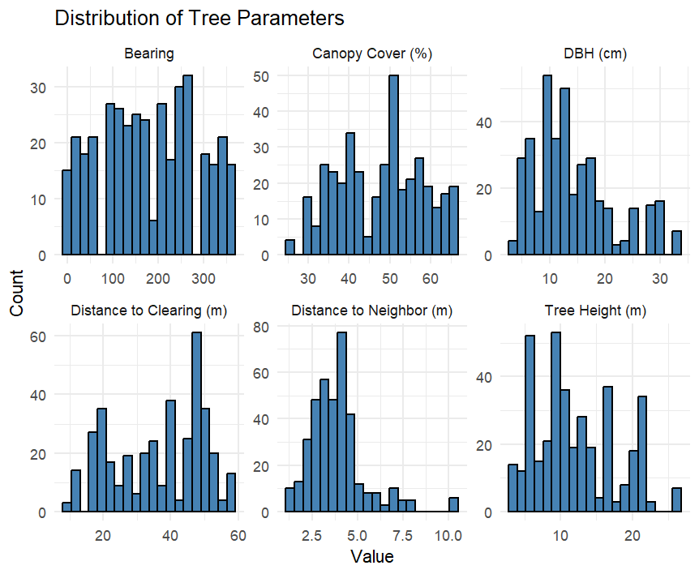
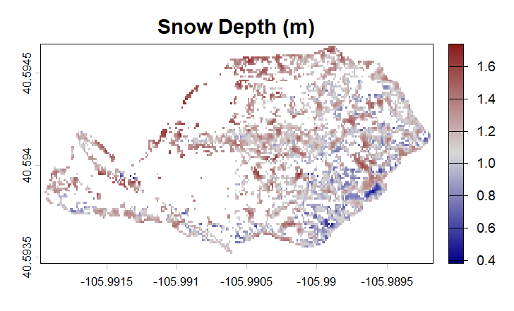
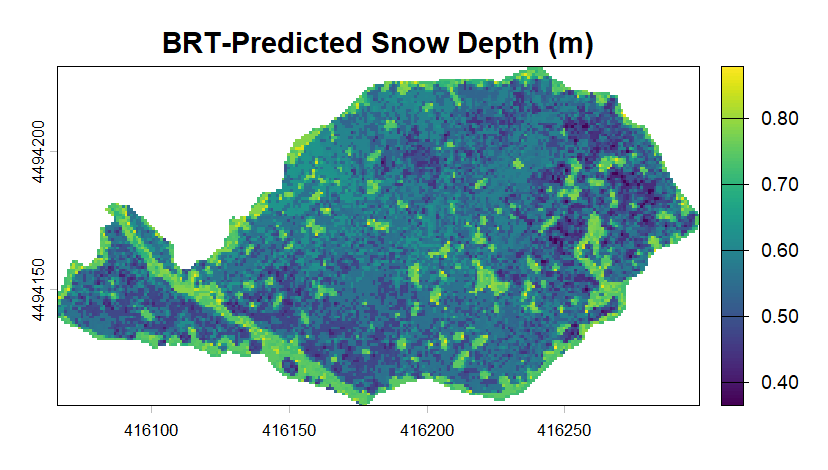

### Snow Density Variability in Lodgepole Pine (*Pinus contorta*) Forests

#### [Objectives]{.underline}

1.  Quantify the spatial variability of snow density in lodgepole pine forests.

2.  Examine correlation between snow density, snow depth, and forest structural characteristics.

3.  Integrate drone-based LiDAR with empirical models to generate spatial predictions of snow depth and density.

4.  Assess the implications of observed variability for snowpack estimation, hydrologic modeling, and forest management.

#### [Study Area]{.underline}

#### [Methods]{.underline}

-   Selected 14 upper montane *P. contorta* forest sites along Highway 14 in northern Colorado using randomly generated coordinates and conducted snowpack sampling during winter 2025.

-   Measured snow depth, snow density, and snow water equivalent (SWE) around 74 sampled trees using snow probes, snow corers, GPS. In the summer forest structure measurements were collected including tree height, DBH, canopy cover, and tree spacing.

-   Developed boosted regression tree (BRT) models in R to evaluate how forest structure, canopy conditions, and spatial position influenced snow depth and snow density using cross-validation and predictor importance metrics.

-   Processed airborne LiDAR snow-on and snow-off datasets to derive terrain and vegetation rasters, then applied BRT models to generate spatial predictions of snow depth and density across study sites.

#### [Results]{.underline}

-   Binary regression tree models identified canopy cover and measurement direction as the most influential controls on snow depth and snow density, with additional effects from DBH, neighboring trees, and proximity to forest clearings.

-   LiDAR data shows inability to penetrate below the canopy, inhibiting the ability to measure snow depth and therefore requiring interpolation or modeling

Figure 7. BRT Modeled snow depth (m) allows for predictions beneath the canopy where LiDAR cannot penetrate.](images/BRT_Predicted_SnowDepth-01.png)

#### [Discussion + Conclusion]{.underline}

These are preliminary results for the completion of my master's in Watershed Science Thesis Dissertation fullfilment at Colorado State University. The Discussion and Conclusion portions of this website cannot be completed due to unfinished data processing. This research and full webspage are estimated to be completed by ***July 2026***.
